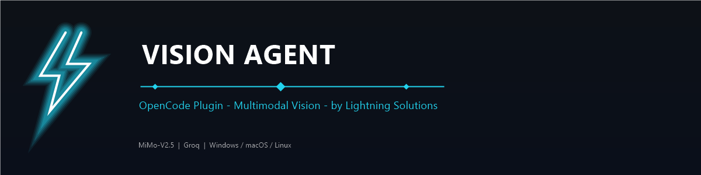
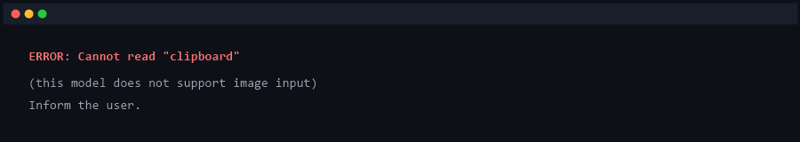
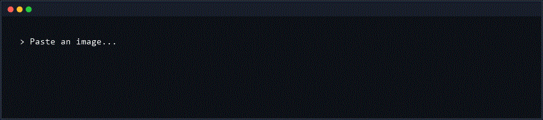
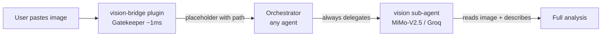

<div align="center">



**Give eyes to OpenCode models that cannot see images.**

[](LICENSE)
[]()
[]()
[]()
[]()

</div>

## Why

Vision Agent gives eyes to OpenCode models that cannot see images. When you
paste a screenshot into the chat with a non-multimodal model, OpenCode fails
with:



In a plain chat session, switching models to "look at an image" is annoying.
In an **orchestrated workflow** — a harness like Gentle-AI, SDD phases, or any
setup with agents delegating to sub-agents — it is a **showstopper**. Your
orchestrator agent drives the whole pipeline, and every agent in that pipeline
shares the same model. Needing vision means either:

- switching the active model mid-workflow (breaks context, breaks momentum,
  breaks automation), or
- manually describing images yourself before pasting them (tedious, slow,
  and it stops the flow dead).

Vision Agent removes that decision entirely. The orchestrator keeps running
its model; image handling is **automatized** — any agent that can delegate
gets eyes, without switching models once. In a harness where automation is
the whole point, that is the difference between a flow and a chore.

**Before and after:**



It works through a two-piece architecture designed for reliability:

- **`vision-bridge` plugin (Gatekeeper)** — detects the pasted image,
  persists it to disk, and replaces it with a placeholder carrying the file
  path. Executes in ~1ms. No API calls, no image processing.
- **`vision` sub-agent (Brain)** — the orchestrator always delegates image
  description to this sub-agent. It runs a multimodal model (MiMo-V2.5 or
  Groq), reads the image from the placeholder path, and returns a detailed
  description.



See [Architecture](docs/ARCHITECTURE.md) for the full rationale.

---

## Quick Start

```powershell
# Windows
powershell -ExecutionPolicy Bypass -c "irm https://raw.githubusercontent.com/ianEstrada/opencode-vision-bridge/master/install.ps1 | iex"
```

```bash
# macOS / Linux
curl -fsSL https://raw.githubusercontent.com/ianEstrada/opencode-vision-bridge/master/install.sh | bash
```

Restart OpenCode, paste an image, done. Full setup in [Installation](#installation).

---

## Table of Contents

- [Why](#why)
- [Quick Start](#quick-start)
- [Installation](#installation)
- [Vision models](#vision-models)
- [Verification](#verification)
- [Conditions and limitations](#conditions-and-limitations)
- [Troubleshooting](#troubleshooting)
- [Repository structure](#repository-structure)
- [License](#license)

---

## Installation

### One-line install (recommended)

Copy and paste ONE command into your terminal. It downloads everything,
installs it, edits your `opencode.json` automatically (with a backup), and
runs a self-check. No npm, no dependencies, no manual steps.

**Windows (PowerShell):**

```powershell
powershell -ExecutionPolicy Bypass -c "irm https://raw.githubusercontent.com/ianEstrada/opencode-vision-bridge/master/install.ps1 | iex"
```

**macOS / Linux (bash):**

```bash
curl -fsSL https://raw.githubusercontent.com/ianEstrada/opencode-vision-bridge/master/install.sh | bash
```

The installer:

1. Detects your OpenCode config directory
2. Downloads and installs the plugin, sub-agent, and `/vision-config` command
3. Edits `opencode.json` (backup saved as `opencode.json.vision-backup`):
   - adds `"vision": "allow"` to every agent's `permission.task`
   - appends the **Image Vision Handoff** rule to each agent's prompt
4. Validates the JSON (restores the backup if anything goes wrong)
5. Runs a self-check

> [!NOTE]
> Configuration does not hot-reload. Restart OpenCode after installing, then
> run `/vision-config` in the chat to choose your vision model.

Manual installation and full configuration reference:
[docs/CONFIGURATION.md](docs/CONFIGURATION.md)

---

## Vision models

The sub-agent needs one multimodal model. Choose the one that fits your setup:

| Model | Access | Limits | Recommendation |
|---|---|---|---|
| **MiMo-V2.5** | Included in the `opencode-go` package | 30,100 requests/5h | **Default — no extra setup** |
| **MiMo-V2.5 Free** | OpenCode Zen (`opencode/mimo-v2.5-free`) | Free, 200K context / 32K output | Best if you do NOT have opencode-go |
| **Groq** `qwen/qwen3.6-27b` | API key (free tier) | ~8K tokens/min, may return HTTP 429 | Only if you already use Groq |

> [!TIP]
> Start with a MiMo variant — no API key required and no aggressive rate
> limits. Use `opencode-go/mimo-v2.5` if you have the opencode-go package,
> or `opencode/mimo-v2.5-free` via OpenCode Zen otherwise. Switch to Groq
> only if you need it for another reason.

---

## Verification

1. Restart OpenCode (configuration does not hot-reload)
2. Paste an image (Ctrl+V or drag and drop)
3. Your message shows the placeholder with the image path (no clipboard error)
4. The orchestrator delegates to the vision sub-agent
5. You receive the full description or analysis of the image

> [!TIP]
> The sub-agent does not only describe — you can ask it to evaluate: *"evaluate
> this UI design"* or *"what does this error say?"* and it returns in-depth
> analysis.

---

## Conditions and limitations

> [!WARNING]
> Images are NEVER resized or downscaled. Resizing degrades fine text and
> causes vision models to hallucinate details (they invent typos and
> characters that do not exist). Full resolution always wins.

- Pasted images are written to the system temp directory and are cleaned up
  by the OS.
- The `vision` sub-agent is read-only: it can read image files but cannot edit
  files or run commands.
- Descriptions are generated by third-party models (MiMo-V2.5, Groq). Review
  their terms of service for acceptable use of generated content.
- Vision API calls may be subject to rate limits depending on the provider
  and plan.

---

## Troubleshooting

| Symptom | Cause | Fix |
|---|---|---|
| `Cannot read "clipboard"` when pasting | Plugin not loaded (OpenCode not restarted) | Restart OpenCode |
| Placeholder says `Image path: unknown` | Image could not be persisted | Check write permissions on the temp directory |
| The `vision` sub-agent is not available | `agent/vision.md` missing or OpenCode not restarted | Run the installer, then restart |
| The orchestrator does not delegate | Image Vision Handoff rule missing from the prompt | See [docs/CONFIGURATION.md](docs/CONFIGURATION.md) |
| Groq returns HTTP 429 | Free-tier rate limit | Switch the sub-agent model to MiMo-V2.5 |
| The description invents text | Image was resized somewhere | Use this plugin unmodified (no resize path exists) |

> [!TIP]
> Still stuck? [Open an issue](https://github.com/ianEstrada/opencode-vision-bridge/issues/new)
> with your setup (OS, OpenCode version, model) and the error message.

---

## Repository structure

```
opencode-vision-bridge/
├── plugin/
│   └── vision-bridge.ts      Gatekeeper (~3 KB, ~1ms)
├── agent/
│   └── vision.md             Brain (multimodal sub-agent)
├── command/
│   └── vision-config.md      /vision-config command
├── config/
│   └── opencode.json.md      Configuration reference
├── docs/
│   ├── CONFIGURATION.md      Manual setup reference
│   └── ARCHITECTURE.md       Design rationale and data flow
├── install.sh                macOS/Linux installer
├── install.ps1               Windows installer
└── README.md
```

---

## Contributing

Found a bug or have an idea? Open an [issue](https://github.com/ianEstrada/opencode-vision-bridge/issues)
or send a pull request. Keep contributions focused: the design rules
([Architecture](docs/ARCHITECTURE.md)) are the contract.

## License

MIT - free to use, modify, and share.

---

**Vision Agent by Lightning Solutions**
